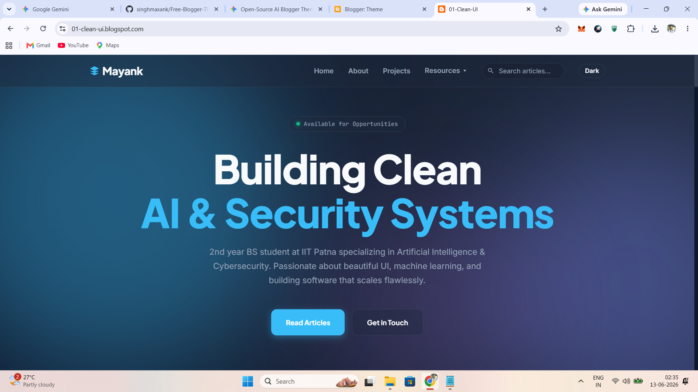
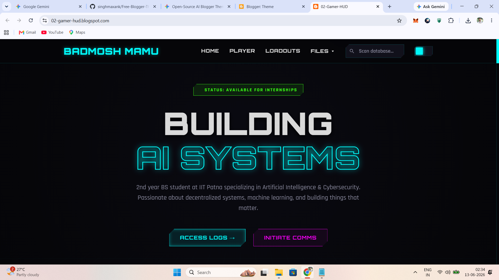
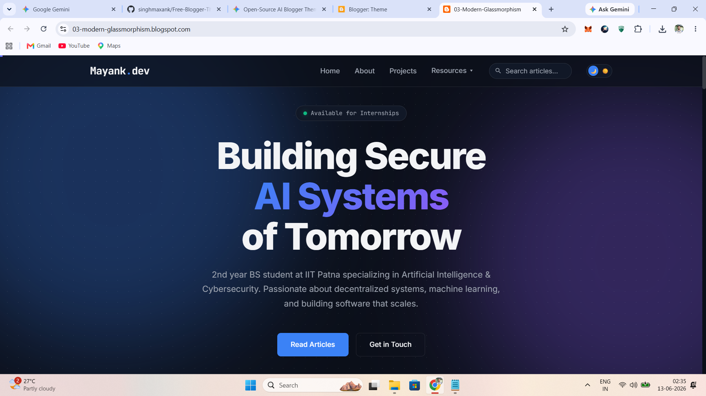
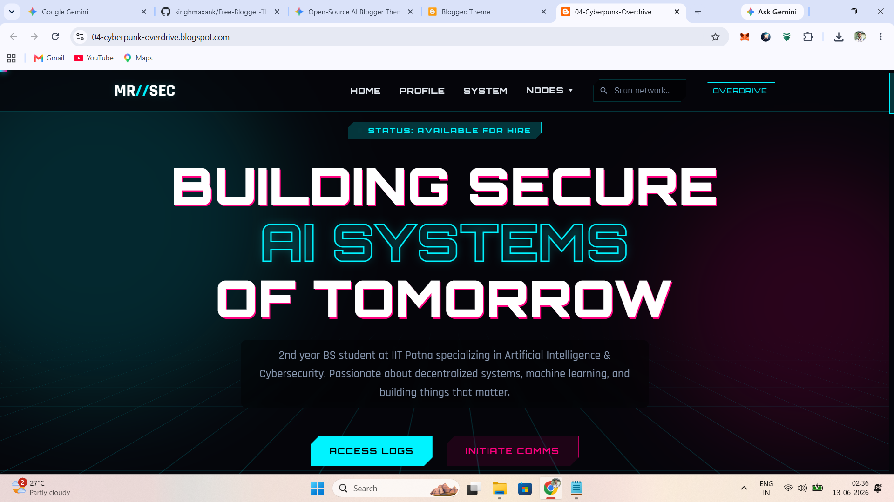
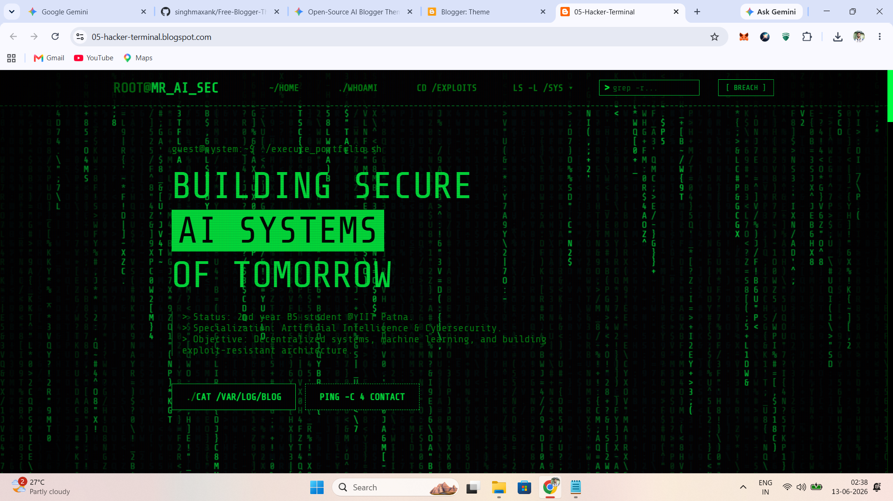
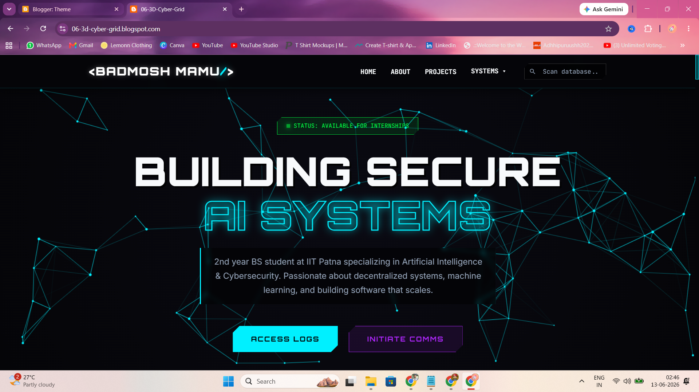
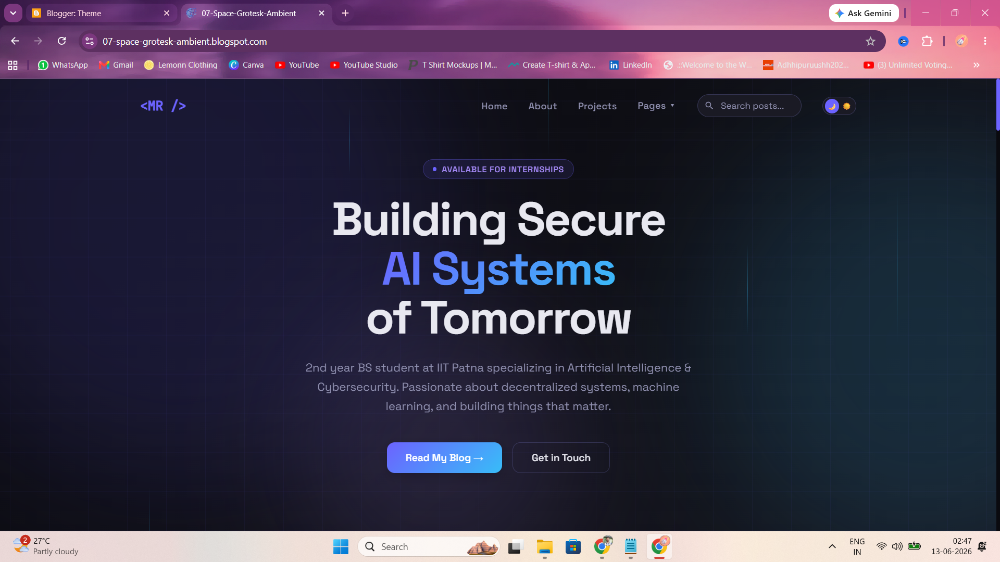

# 🚀 Mayank's Open-Source Blogger Themes

A curated collection of 7 free, highly interactive, and responsive Blogger templates. These themes feature advanced CSS animations, custom dark/light modes, live canvas backgrounds, and clean UI/UX designs. 

They are completely free to use for personal portfolios, tech blogs, or commercial projects.

---

## 🎨 The Collection

### 1. Clean UI Core
A minimalist, corporate-friendly aesthetic featuring deep slate gradients, glassmorphism cards, and a crystal blue accent. Perfect for professional developer portfolios.
* **[🔴 View Live Demo](https://01-clean-ui.blogspot.com/)**

### 2. Gamer HUD
An ultimate tech palette with cyber cyan, neon purple, and an interactive canvas background. Designed for gaming and tech-heavy blogs.
* **[🔴 View Live Demo](https://02-gamer-hud.blogspot.com/)**

### 3. Modern Glassmorphism
Clean, crisp design using the Inter font family, subtle panning dot grids, and glowing abstract ambient orbs.
* **[🔴 View Live Demo](https://03-modern-glassmorphism.blogspot.com/)**

### 4. Cyberpunk Overdrive
High-contrast neon pink and cyan with an overdrive toggle, perspective grid backgrounds, and text glitch hover effects.
* **[🔴 View Live Demo](https://04-cyberpunk-overdrive.blogspot.com/)**

### 5. Hacker Terminal (System Breach)
A pure monospace terminal interface featuring an HTML5 matrix rain canvas, CRT scanline overlays, and a dynamic boot sequence.
* **[🔴 View Live Demo](https://05-hacker-terminal.blogspot.com/)**

### 6. 3D Cyber Grid
Built for gaming and security blogs, featuring a live 3D perspective grid, scanlines, and highly saturated neon magenta and cyan accents.
* **[🔴 View Live Demo](https://06-3d-cyber-grid.blogspot.com/)**

### 7. Space Grotesk Ambient
An elegant, smooth theme featuring a true live gradient background, falling data streams, and refined Space Grotesk typography.
* **[🔴 View Live Demo](https://07-space-grotesk-ambient.blogspot.com/)**

---

## ⚙️ How to Install on Blogger

1. Click on the theme folder you want to use above and download the `.xml` file.
2. Log in to your **Blogger Dashboard**.
3. Navigate to **Theme** on the left sidebar.
4. Click the down arrow next to the **Customize** button and select **Restore**.
5. Click **Upload** and select the `.xml` file you just downloaded.
6. Refresh your blog and enjoy the new design!

---

## 🛠️ Built With
* Native Blogger XML
* Advanced CSS3 (Animations, Glassmorphism, CSS Variables)
* Vanilla JavaScript (Interactive canvases, custom toggles, scroll reveals)
* HTML5

## 🤝 Connect with Me
Want to see how these themes are built, or follow my journey in AI and cybersecurity? 
* **YouTube:** [Subscribe to Badmosh Mamu](https://www.youtube.com/@badmoshmamu)
* **Instagram:** [Follow @singhmaxank](https://instagram.com/singhmaxank)

## 📜 License
This project is open-source and available under the MIT License. Feel free to modify, distribute, and use these themes. If you use them, a shoutout or backlink is always appreciated!

**Designed by Mayank Raj**
